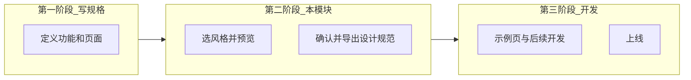
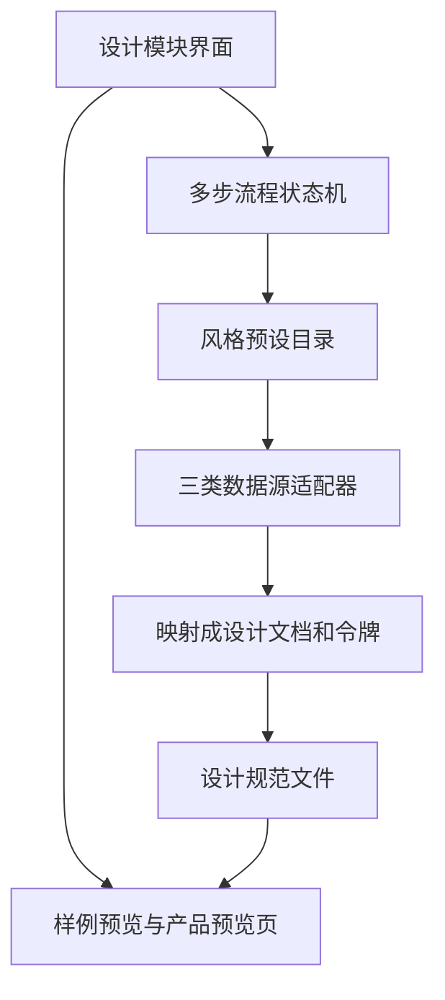

# 交互与界面设计模块 — 功能介绍

> **文档版本**：最小可用版本（2026 年 6 月）  
> **所属产品**：软件开发平台（规划中的 `dev-platform-web`）  
> **技术底座**：AI 设计范式仓库 — 设计文档、设计令牌、状态机、持续集成  
> **关联计划**：`.cursor/plans/ui设计模块意图对齐_24c7fa96.plan.md`

---

## 一、模块是什么

**交互与界面设计**是软件开发平台里、介于「功能规格已经定好」和「开始写代码」之间的**第二个阶段**。

它主要给**不会写代码的创始人或产品经理**用，让他们可以：

1. 用中文补充界面和交互方面的要求；
2. 从预设库里选视觉风格（按美学类型选，或按「像某个知名产品」选）；
3. 分两步看预览：先看风格样例，再看套在自己产品页面上的效果；
4. 确认之后，导出工程能直接用的**设计规范文件**，并生成**一个示例页面**，给工程师或 AI 接着做。

核心理念：**Git 仓库里的设计文档和设计令牌是唯一标准**，不靠截图、不靠零散聊天里的「再蓝一点」。

---

## 二、解决什么问题

| 常见痛点 | 本模块怎么帮 |
|----------|--------------|
| AI 做的界面都差不多、很「模板感」 | 接入多套可命名、可重复使用的风格库 |
| 产品经理说不清要什么气质，工程师只能猜 | 用风格卡片 + 即时预览，先对齐再开发 |
| 设计和开发各说各话，改颜色要全项目搜 | 导出统一的设计令牌，持续集成可以自动检查 |
| 功能文档和视觉文档两套 | 长期由规格驱动预览；本阶段先用内置演示数据跑通流程 |

---

## 三、在整体流程里的位置



- **以后**：用户在平台里写完规格，再进入本模块。  
- **现在（最小可用版本）**：规格搭建还不归本模块负责；先用内置的**演示 SaaS 假数据**验证整条链路，并留好接口，等规格模块接进来再替换。

---

## 四、核心概念

### 4.1 两个标签页：两种选风格的方式

| 标签页 | 在回答什么问题 | 数据从哪来 | 举例 |
|--------|----------------|------------|------|
| **美学风格** | 界面整体是什么**视觉气质**？ | 设计技能库 + 界面提示词库 | 玻璃拟态、新粗野、极简、赛博朋克 |
| **品牌参考** | 界面**像哪个知名产品**？ | 逆向分析过的品牌设计文档 | 类似某笔记软件、某支付产品、某编辑器 |

**本阶段规则**：两个标签页**只能选一个**作为主风格；「美学 + 品牌叠在一起」放到下一版再做。

### 4.2 两步预览（已选定的方案）

| 步骤 | 用户看到什么 | 为什么要这一步 |
|------|--------------|----------------|
| **第一步：看风格样例** | 一段通用的样例网页（美学页用现成的 HTML 样例；品牌页用平台样例壳 + 品牌配色） | 快速判断「喜不喜欢这种味道」 |
| **第二步：应用到我的产品** | 演示产品里的**工作台页面**套上所选风格 | 判断「像不像我要做的产品」 |

主要按钮文案：**「应用到我的产品」**。

### 4.3 确认风格后会产出什么

| 产出物 | 是什么 | 谁用 |
|--------|--------|------|
| 根目录设计文档 | 颜色、字体、间距等硬性规定 + 设计意图说明 | 工程师、AI 编程助手 |
| 设计令牌目录 | 可编译成样式变量的源文件 | 构建流程、样式框架 |
| 可选的补充提示词文件 | 风格库里的「该做 / 不该做」整理成附录 | AI 生成界面时参考 |
| 一个示例页面（Vue） | 按代表页骨架生成，禁止写死色值 | 后续页面的样板 |
| 压缩包或写入产品目录 | 方便交给工程或接入 Git | 研发团队 |

---

## 五、界面长什么样（产品经理视角）

```
┌─────────────────────────────────────────────────────────────┐
│  交互与界面设计                                              │
├──────────────────────┬──────────────────────────────────────┤
│  标签：美学风格 | 品牌参考（二选一）                          │
│  风格卡片列表         │  预览区域                             │
│  补充说明（可选）     │  先看样例 → 再「应用到我的产品」      │
│  [确认风格]           │  可切换桌面 / 手机宽度（可选）        │
└──────────────────────┴──────────────────────────────────────┘
```

产品经理**不必看到**：令牌文件路径、Git 分支、状态机内部名称（可收到「高级」里）。

---

## 六、技术结构（简述）



本仓库里可直接复用的部分：品牌导入脚本、令牌映射逻辑、AI 助手规则文档、多步流程示例、多主题预览参考项目。

---

## 七、本阶段做与不做什么

### 要做

- 内置演示用的产品规格（首页、工作台、登录；代表页固定为工作台）
- 两个标签页的风格选择（美学合并目录 + 品牌列表）
- 两步预览
- 导出设计文档和设计令牌
- 生成一个示例页面，并通过设计校验命令

### 不做

- 规格搭建界面和真实规格服务对接（只留接口）
- 同时选美学和品牌并合并（下一版）
- 一次生成全站、同步 Figma、团队审批流

### 怎样算本阶段完成

- [ ] 不用先写规格，就能打开设计模块
- [ ] 美学标签页：点卡片能看到样例预览
- [ ] 品牌标签页：点卡片能看到换色后的样例
- [ ] 点「应用到我的产品」：工作台预览随风格变化
- [ ] 点「确认风格」：能导出或写入设计规范
- [ ] 示例页面生成成功，设计校验通过

---

## 八、和外部工具的关系

| 外部资源 | 在本模块里的作用 |
|----------|------------------|
| 设计技能平台 | 提供美学类设计技能文件 |
| 界面风格提示词网站 | 提供样例 HTML 和中英文提示词 |
| 品牌设计文档合集 | 品牌参考标签页的数据源 |
| Cursor 等 AI 工具 | 读取设计规范继续写代码 |

---

## 九、以后可以扩展什么

- 接入真实产品规格，自动选代表页
- 美学和品牌可以叠加（气质 + 色板）
- 上传参考图提取风格
- 多页面自动生成、一键部署
- 团队评审、版本对比

---

## 十、相关文档

| 文档 | 位置 |
|------|------|
| 用户故事 | [交互与界面设计模块-用户故事.md](./交互与界面设计模块-用户故事.md) |
| 意图对齐计划 | `.cursor/plans/ui设计模块意图对齐_24c7fa96.plan.md` |
| 范式总手册 | 仓库根目录的设计文档、助手规则、团队手册 |
