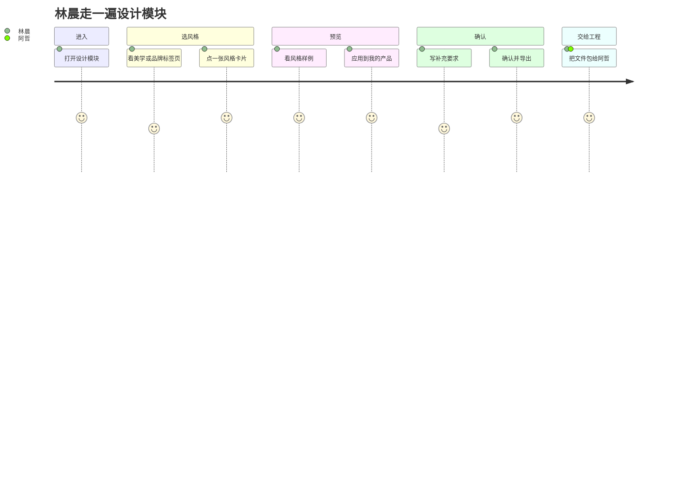

# 交互与界面设计模块 — 用户故事

> **文档版本**：最小可用版本（2026 年 6 月）  
> **主要人物**：**林晨** — 不会写代码的产品创始人  
> **次要人物**：**阿哲** — 全栈工程师  
> **本阶段说明**：林晨用的是内置**演示 SaaS 假数据**，不是真实规格；以后规格会在平台别处写好再传进来。

---

## 人物简介

### 林晨（产品经理 / 创始人）

- 功能想清楚了，但不会画高保真稿，也不会写前端。
- 想说「像某某产品那样干净」或「再科技一点」，需要能**看见**。
- 最担心：工程师做出来的界面和脑子里完全不是一回事，改一整周。

### 阿哲（工程师）

- 用 AI 设计范式模板开发项目，遵守仓库里的助手规则。
- 要的是能执行的设计文档和令牌，不要聊天里一句「蓝一点」。
- 希望至少有一个示例页，照着把其他页面补全。

---

## 用户旅程概览

---

## 总目标（史诗）

**设计模块总目标**：作为产品经理，在功能定好之后、开发开始之前，能通过可视化方式选定界面风格并导出设计规范，让工程和 AI 按同一套标准做界面。

---

## 分条用户故事

写法：**作为**某人，**我想要**做某事，**以便**达到某目的。  
每条下面用 **假定 / 当 / 那么 / 并且** 写验收条件。

---

### 故事 01 — 进入设计模块

**作为** 林晨  
**我想要** 直接打开「交互与界面设计」  
**以便** 不用等规格模块联调，先验证选风格和预览能不能用  

**优先级**：最高（本阶段必做）

**验收条件**

- **假定** 设计模块已经部署（本阶段用内置演示 SaaS 假数据）  
- **当** 林晨从菜单或地址进入设计模块  
- **那么** 左边是选风格区域，右边是预览区域，并提示当前演示产品名称  

**说明**：本阶段不要求先完成规格搭建；假数据里包含首页、工作台、登录，代表页是工作台。

---

### 故事 02 — 浏览美学风格

**作为** 林晨  
**我想要** 在「美学风格」标签页里浏览带中文说明的卡片  
**以便** 用「玻璃拟态、极简」这类气质词表达偏好，而不是硬说品牌名  

**优先级**：最高

**验收条件**

- **假定** 林晨在设计模块，且停在「美学风格」标签页  
- **当** 她上下滚动卡片列表  
- **那么** 每张卡片有中文名和短说明，总数在本阶段可浏览范围内（大约十几到二十几张，不要上百张刷屏）  

---

### 故事 03 — 浏览品牌参考

**作为** 林晨  
**我想要** 在「品牌参考」标签页里选熟悉的产品  
**以便** 跟工程师说「气质像它」时有共同参照  

**优先级**：最高

**验收条件**

- **假定** 林晨切到「品牌参考」标签页  
- **当** 她浏览品牌卡片  
- **那么** 列表来自品牌设计文档导入能力，且和「美学风格」分标签展示、不混在一起  

---

### 故事 04 — 两个标签页只能选一个

**作为** 林晨  
**我想要** 美学和品牌里最终只生效一个主风格  
**以便** 本阶段决策简单，导出的设计规范只有一份  

**优先级**：最高

**验收条件**

- **假定** 林晨已在美学页选了「玻璃拟态」  
- **当** 她切到品牌页并点了「类似某笔记软件」  
- **那么** 美学那边的选中会取消，或明确提示「现在以品牌为准」，整个会话里只有一个当前风格  

**说明**：下一版才支持美学和品牌叠加；本条只覆盖本阶段。

---

### 故事 05 — 第一步：看风格样例

**作为** 林晨  
**我想要** 点卡片后右边马上出现该风格的样例网页  
**以便** 十几秒内判断喜不喜欢  

**优先级**：最高

**验收条件**

- **假定** 林晨在美学页选了「玻璃拟态」  
- **当** 卡片处于选中状态  
- **那么** 右侧预览区展示该风格自带的 HTML 样例（或等效备用样例），整页不用刷新  

- **假定** 林晨在品牌页选了某个品牌  
- **当** 卡片处于选中状态  
- **那么** 右侧展示平台统一样例壳 + 该品牌配色换肤后的效果  

---

### 故事 06 — 第二步：应用到我的产品

**作为** 林晨  
**我想要** 点「应用到我的产品」  
**以便** 在同一风格下看到**自己产品结构**（工作台布局）长什么样  

**优先级**：最高

**验收条件**

- **假定** 林晨已选风格并看过样例  
- **当** 她点「应用到我的产品」  
- **那么** 预览变成演示 SaaS 的**工作台**，颜色、字体、圆角等随所选风格变化  
- **并且** 可以返回再看样例，不会卡在第二步出不来  

---

### 故事 07 — 写补充要求（可选）

**作为** 林晨  
**我想要** 用中文写几句额外要求  
**以便** 导出时写进设计说明，给 AI 和工程师看  

**优先级**：中等（本阶段可以只做简单文本框）

**验收条件**

- **假定** 林晨已选风格  
- **当** 她在补充说明里写字并继续确认  
- **那么** 导出的设计文档正文或附录里包含这段「产品侧意图」  

---

### 故事 08 — 确认风格并导出

**作为** 林晨  
**我想要** 点「确认风格」后拿到完整设计规范包  
**以便** 发给阿哲或放进 Git 仓库开干  

**优先级**：最高

**验收条件**

- **假定** 林晨预览满意  
- **当** 她点「确认风格」  
- **那么** 系统生成或更新根目录设计文档和令牌目录（美学走技能映射，品牌走品牌导入映射）  
- **并且** 她能下载压缩包或看到文件写在哪  
- **并且** 产物能通过设计校验命令（工程在持续集成里跑）  

---

### 故事 09 — 生成示例页面

**作为** 林晨  
**我想要** 确认风格后至少有一个示例界面代码  
**以便** 给阿哲看「成品大概长这样」，不只是色板  

**优先级**：最高

**验收条件**

- **假定** 设计规范已导出  
- **当** 确认流程结束  
- **那么** 有一个基于演示工作台的 Vue 示例页，样式全走设计令牌，没有写死色值  
- **并且** 阿哲本地启动开发服务能打开这页核对  

---

### 故事 10 — 工程师接手

**作为** 阿哲  
**我想要** 收到设计规范、示例页和风格来源说明  
**以便** 用 Cursor 按助手规则扩展其他页面，不再扯皮颜色  

**优先级**：最高

**验收条件**

- **假定** 林晨完成了故事 08、09  
- **当** 阿哲打开产品仓库  
- **那么** 能读到设计文档、令牌目录和示例页路由  
- **并且** AI 助手按规范写代码，不会乱用默认灰蓝配色  

---

### 故事 11 — 切换手机 / 桌面预览（可选）

**作为** 林晨  
**我想要** 在桌面宽度和手机宽度之间切换预览  
**以便** 看窄屏下风格还能不能接受  

**优先级**：低（本阶段可不做）

**验收条件**

- **当** 她切换设备类型  
- **那么** 预览区宽度跟着变，除非产品本身需要，否则不要出现难看的大横条滚动  

---

## 本阶段故意不做的事

| 编号 | 内容 | 原因 |
|------|------|------|
| 规格联动 | 在平台写完规格后自动跳进设计模块 | 规格模块别人做 |
| 风格叠加 | 同时选美学和品牌并合并成一份规范 | 下一版 |
| 导出设计稿 | 导出到 Figma | 不在本阶段 |
| 全站生成 | 一次生成十个页面 | 不在本阶段 |

---

## 优先级汇总

| 优先级 | 编号 | 标题 |
|--------|------|------|
| 最高 | 01 | 进入设计模块 |
| 最高 | 02 | 浏览美学风格 |
| 最高 | 03 | 浏览品牌参考 |
| 最高 | 04 | 两个标签页二选一 |
| 最高 | 05 | 看风格样例 |
| 最高 | 06 | 应用到我的产品 |
| 最高 | 08 | 确认并导出 |
| 最高 | 09 | 生成示例页 |
| 最高 | 10 | 工程师接手 |
| 中等 | 07 | 写补充要求 |
| 低 | 11 | 切换设备预览 |

---

## 完整走一遍（故事化描述）

林晨打开「交互与界面设计」。她在**美学风格**里点了「玻璃拟态」，右边出现一段深色玻璃质感的样例页——「对，就要这种科技感」。她又担心和自己产品布局对不上，点了**「应用到我的产品」**：预览变成演示 SaaS 的**工作台**，侧栏和卡片都套上了玻璃风格。她在补充说明里写「专业、克制、面向企业、不要表情符号」，再点**确认风格**。系统导出设计文档和令牌，并生成一个工作台示例页。她把压缩包发给阿哲：「按这个做，结构参考示例页。」阿哲把仓库接进 AI 设计范式，让 Cursor 读设计文档前几章、照着示例页做设置页。**界面该什么样，在设计模块里已经说清楚了。**

---

## 相关文档

- [交互与界面设计模块-介绍.md](./交互与界面设计模块-介绍.md)
