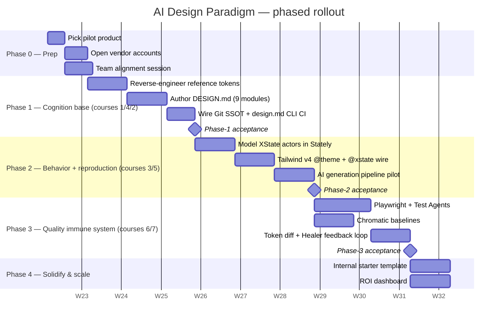

# Rollout Roadmap

Phased modular integration strategy for the AI-driven design & engineering pipeline.

## Acceptance criteria per phase

### Phase 1 — Cognition base
- `DESIGN.md` parses, lints WCAG AA, and is the SSOT in CI.
- `tokens/` compiles to four platforms via Style Dictionary.
- Cursor / Claude Code refuses to default to stock Tailwind palette in test prompts.

### Phase 2 — Behavior + reproduction
- A working MVP screen is built end-to-end by an AI agent in ≤ 60 min, using:
  - tokens from `tokens/**`
  - an XState actor from `src/machines/**`
  - and zero raw HEX / arbitrary px.

### Phase 3 — Quality immune system
- A deliberate primary-color shift triggers:
  - `token-diff` PR comment
  - Chromatic visual diff report
  - Healer-proposed locator patches
- Mean time from regression introduction to detection ≤ 10 minutes in CI.

### Phase 4 — Scale
- A second product team adopts the starter template with < 1 day of onboarding.
- ROI dashboard tracks: gen-to-merge time, AI-generated LOC share, escaped UI bugs, Healer fix rate.

## Owners

| Phase | Lead | Supporting teams |
|---|---|---|
| 0 | Engineering Manager | All |
| 1 | Design Ops | Frontend Platform |
| 2 | Frontend Platform | Design Ops |
| 3 | QA | Frontend Platform, Platform |
| 4 | Engineering Manager | All |
